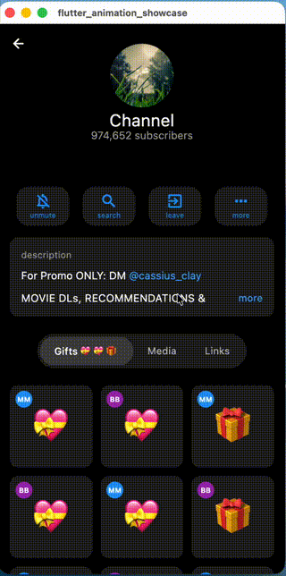

# Flutter Animation Showcase

A collection of beautifully crafted animations from popular apps, recreated in Flutter.

---

## Telegram Profile Animation

A pixel-perfect recreation of Telegram's profile header animation featuring smooth transitions between collapsed, expanded, and full-screen states.

<p align="center">
  
</p>

### Usage

```dart
import 'package:flutter_animation_showcase/telegram/sliver_telegram_app_bar.dart';

CustomScrollView(
  slivers: [
    SliverTelegramAppBar(
      title: 'John Doe',
      subTitle: 'Online',
      imageUrl: 'https://example.com/avatar.jpg',
      actions: [
        TelegramActionButton(icon: Icons.call, label: 'Call'),
        TelegramActionButton(icon: Icons.videocam, label: 'Video'),
        TelegramActionButton(icon: Icons.search, label: 'Search'),
        TelegramActionButton(icon: Icons.more_horiz, label: 'More'),
      ],
    ),
    // Your content slivers here
  ],
)
```

For customization options, check out [`sliver_telegram_app_bar.dart`](lib/telegram/sliver_telegram_app_bar.dart).

---

## License

MIT License
